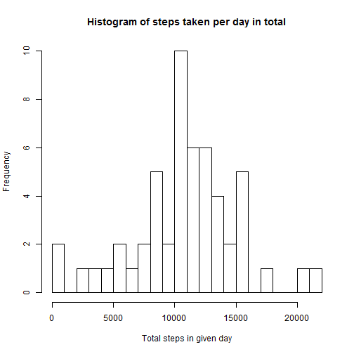
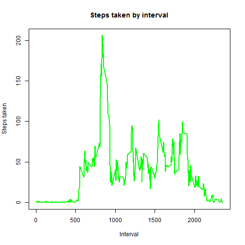
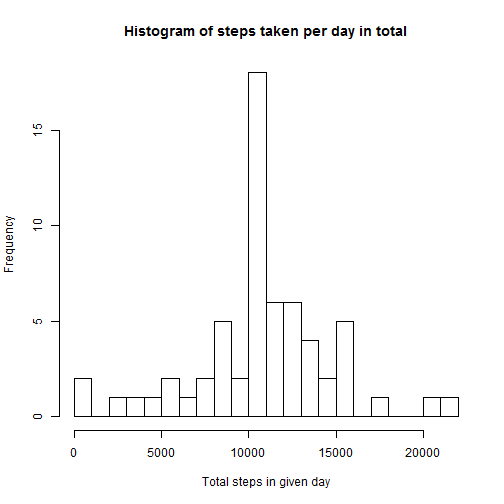
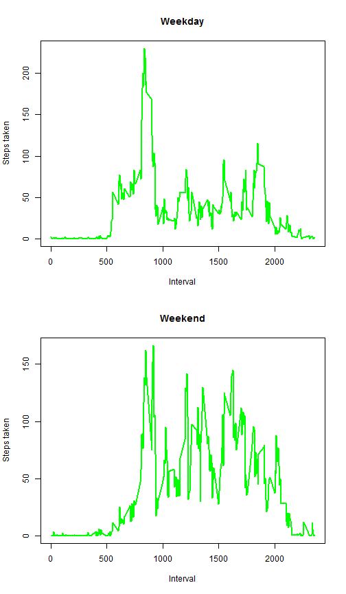

Assignment no 1 by Mait22  
==========================  


##Loading in the data
Following r code loads in the data set "activity.csv" placed in working directory
of Your machine.


```r
work_dir <- getwd()
file_path <- paste(work_dir,"/activity.csv",sep = "")
activity <- read.csv(file_path,header = TRUE,na.strings = NA,
                     stringsAsFactors = FALSE)
```


##Calculating the total number of steps taken per day 
I use plyer package to complete this task - install it if needed.


```r
#install.packages("plyer") ##uncomment and install the package if needed
library(plyr)
descriptives <- ddply(activity,~date,summarise,tot_steps=sum(steps))

steps_per_day_median <- median(descriptives$tot_steps,na.rm = TRUE)
steps_per_day_mean <- as.integer(round(mean(descriptives$tot_steps,na.rm = TRUE),1))

hist(as.numeric(descriptives$tot_steps),ylab = "Frequency",xlab= "Total steps in given day",main = "Histogram of steps taken per day in total",breaks = 20)
```

 

The median number of total steps taken per day is 10765  
The mean number of total steps taken per day is 10766


#Plotting the average daily activity by time interval

Following r code calculates the daily average activity by interval  

```r
descriptives_by_interval <-ddply(activity,~interval,summarise,mean=mean(steps,na.rm = TRUE),
                                                  sd=sd(steps,na.rm = TRUE))

descriptives_by_interval <- arrange(descriptives_by_interval, desc(mean))
```

Following table presents the top 5 intervals with highest level of average steps taken.

```r
library(xtable) #Install if needed
library("knitr") #Install if needed
library("xtable") #Install if needed
xt <- xtable(descriptives_by_interval[1:5,])
kable(xt, caption = "Top 5 intervals with highest degree of steps",digits = 2,align = "l")
```


|interval |mean   |sd     |
|:--------|:------|:------|
|835      |206.17 |293.00 |
|840      |195.92 |263.38 |
|850      |183.40 |266.22 |
|845      |179.57 |238.80 |
|830      |177.30 |249.48 |

Plotting steps taken by interval across all days in dataset

```r
descriptives_by_interval <- arrange(descriptives_by_interval, desc(interval))

plot(descriptives_by_interval$interval,descriptives_by_interval$mean, type = "l",xlab = "Interval",ylab = "Steps taken", main = "Steps taken by interval",lwd = 2, col ="green")
```

 


```r
num_of_na <- sum(is.na(activity[,1]))
```
#Imputing the missing data

In total the data had 2304 rows with missing activity data. 

####Following strategy was used to impute for missing data:  
-  Averages for each time intervals were calculated  
-  For loop was constructed (see following r code chunk) to check if current row has missing value, if so the average value of given row's interval was used to fill in for missing data 


```r
missing_values_imputed <- activity

for (i in 1:length(missing_values_imputed[,1])){
       if (is.na(missing_values_imputed[i,1]) == TRUE)
              {
              missing_values_imputed[i,1] <- descriptives_by_interval[descriptives_by_interval[,1] == missing_values_imputed[i,3],2]
       }
}
```


```r
descriptives_new <- ddply(missing_values_imputed,~date,summarise,tot_steps=sum(steps))

new_median <- as.integer(median(descriptives_new$tot_steps,na.rm = TRUE))
new_mean <- as.integer(round(mean(descriptives_new$tot_steps,na.rm = TRUE),1))
```


After the imputation of data the median value of steps per day was 10766 and new average of steps per day was 10766.  
Histogram of activity after imputing for missing data is presented next:


```r
hist(as.numeric(descriptives_new$tot_steps),ylab = "Frequency",xlab= "Total steps in given day",main = "Histogram of steps taken per day in total",breaks = 20)
```

 


##Making plots to decide if there is difference in activity patterns between weekdays and weekends


```r
#Making the plot
missing_values_imputed$date <- weekdays(as.Date(missing_values_imputed$date))
weekdays <- missing_values_imputed[missing_values_imputed$date %in% c("Monday","Tuesday","Wednesday","Thursday","Friday"),]
weekend <-  missing_values_imputed[missing_values_imputed$date %in% c("Saturday","Sunday"),]      

descriptives_weekdays <- descriptives <- ddply(weekdays,~interval,summarise,mean=mean(steps,na.rm = TRUE),
                                                  sd=sd(steps,na.rm = TRUE))

descriptives_weekends <- descriptives <- ddply(weekend,~interval,summarise,mean=mean(steps,na.rm = TRUE),
                                                  sd=sd(steps,na.rm = TRUE))

descriptives_weekdays <- arrange(descriptives_weekdays, interval)
descriptives_weekends <- arrange(descriptives_weekends, interval)

par(mfrow =c(2,1))
plot(descriptives_weekdays$interval,descriptives_weekdays$mean, type = "l",xlab = "Interval",ylab = "Steps taken", main = "Weekday",lwd = 2, col ="green")
plot(descriptives_weekends$interval,descriptives_weekends$mean, type = "l",xlab = "Interval",ylab = "Steps taken", main = "Weekend",lwd = 2, col ="green")
```

 


From the visual inspection of graphs it seems that in weekends the later time intervals have markedly higher activity level compared to in-week days.
